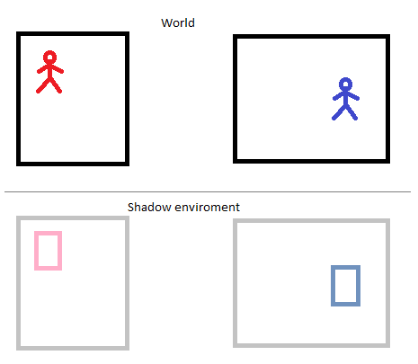

# NavMesh navigation on moving platforms in Unity

Moving an agent on a NavMesh in Unity is great for static environments. Navigating on moving platforms (e.g. a moving ship) can be challenging regarding jitter and networking.

This project aims to solve these issues by introducing an off-screen shadow environment that contains the NavMeshes and agents of all platforms at static locations:

The NavMesh is generated in the shadow environment during development. At runtime, shadow agents are instantiated for each world agent. Whenever the world agent is supposed to navigate on the platform, the navigation is actually be performed by the shadow agent and the location is transformed back and applied to the world agent.

Agents can move between the platforms using a link object, e.g. a wooden board that touches both ships. The platforms must not move while a link exists.

## Generating the NavMeshes

The NavMeshes of the platforms need to be built at the shadow environment location, which (in this demo) is below sea level at y=-100. To do that, follow these manual steps:

1. Move "Platform A" to the location of "Platform A NavMesh Origin"
2. Move "Platform B" to the location of "Platform B NavMesh Origin"
3. Hit "Bake" in the Navigation Window
4. Move both platforms back to their previous location
